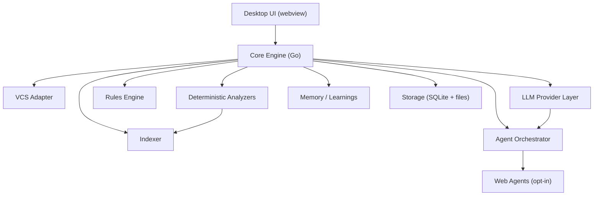
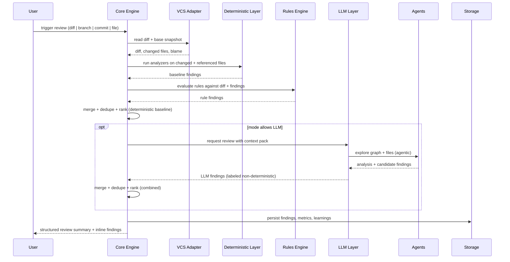

# Architecture - Loka

> Companion to `docs/CONSTITUTION.md`. This document specifies the technical
> architecture of the local-first AI code reviewer. It is the source of truth
> for component boundaries, data flow, and runtime behavior.

## 1. Overview

Loka is a **desktop application**: a Wails v2 shell (Go backend, system
webview frontend) wrapping a **Go core engine**. The engine reviews a
repository by running a deterministic analyzer pipeline and, when enabled, an
LLM/agent layer. All state (index, learnings, rules, findings, history) lives
in the user's local filesystem.

Three architectural commitments shape everything:

1. **Offline-first.** Every pipeline stage has an offline path. The
   deterministic layer needs no network at all; the LLM layer defaults to
   local models.
2. **Plugin seams.** Analyzers, LLM providers, agents, and rules are
   interfaces. The core imports no vendor SDK.
3. **Evidence-linked findings.** Findings are data: location, category,
   severity, source, and reasoning. The UI renders them; nothing is a bare
   string.

## 2. Component Architecture



| Component | Responsibility |
|-----------|----------------|
| Desktop UI | Review workbench: repo picker, review triggers, findings list, inline diff, rule editor, history. |
| Core Engine | Orchestrates review lifecycle, mode enforcement, config resolution, deduplication, ranking. |
| VCS Adapter | Reads local git repositories: diff, blame, history, working tree. Never writes. (Invariant I7.) |
| Indexer | Builds and queries the lightweight graph index (symbols, types, imports, dependencies). |
| Deterministic Analyzers | Tree-sitter parsers, linters, SAST checks. Always run; produce the reproducible baseline. |
| Rules Engine | Applies `review_rules.md` + path-scoped instructions + synced third-party rule files. |
| LLM Provider Layer | Plugin interface for local (Ollama, llama.cpp) and remote (OpenAI-compatible) models. |
| Agent Orchestrator | Spawns Review, Verification, and (opt-in) Web agents; manages context, budgets, and merging. |
| Memory / Learnings | Distills accepted/rejected feedback into durable preferences. |
| Storage | SQLite database + plain files for index, learnings, history, and findings. |
| Web Agents | Optional agents with network + browser capability; gated by per-repo consent. |

## 3. Runtime and Execution Modes

### 3.1 Mode resolution

Mode is resolved per repository from local config, in this priority:

1. Repository-local config (`.loka/review.yaml` or UI settings for the repo).
2. User-global config.
3. Defaults: **offline**, remote features disabled.

### 3.2 Mode semantics

| Feature | Offline | Online (explicit) | Agent mode (explicit) |
|---------|---------|-------------------|------------------------|
| Deterministic analyzers | yes | yes | yes |
| Rules engine | yes | yes | yes |
| Local LLM (Ollama/llama.cpp) | yes | yes | yes |
| Remote LLM APIs | blocked | yes (user keys) | yes |
| Web/browser agents | blocked | blocked | yes |
| Issue tracker / external context | blocked | blocked | yes |
| Network calls | none | provider APIs only | provider APIs + declared web scope |

### 3.3 Degradation rules

- If a remote provider is enabled but unreachable, Loka **fails over to the
  local provider** and labels findings accordingly; it never fails the review.
- If no LLM of any kind is available, Loka still delivers the deterministic
  baseline findings (Invariant I2, I3).
- Every network-capable stage logs its egress targets so the user can audit
  what left the machine.

## 4. Core Engine

### 4.1 Review lifecycle



### 4.2 Context pack

The context pack is what the LLM layer receives. It is assembled from:

- The diff (hunks, not the whole file).
- The graph index slice relevant to changed symbols (callers/callees).
- Findings already produced by the deterministic layer (so the LLM does not
  duplicate them and can reason about them).
- Applicable rules and learnings.
- A strict token budget; oversized packs are truncated by relevance, never
  by "first N files."

### 4.3 Deduplication and ranking

- Deterministic findings are the ground truth and are never deduplicated
  against LLM findings; they are merged by location + category.
- LLM findings that contradict a deterministic finding are flagged for review
  rather than silently dropped.
- Ranking weights: severity (from analyzer/rule), confidence (LLM self-score),
  location (changed lines weighted over surrounding context), and novelty
  (not already known from previous reviews).

## 5. Indexer (Lightweight Graph Index)

### 5.1 What is indexed

Per repository, stored in SQLite:

- **Files**: path, language, hash, last-modified.
- **Symbols**: functions, types, structs, methods, interfaces, globals.
- **References**: calls and imports (edge: symbol -> symbol, file -> file).
- **Dependencies**: external modules and their usage sites.

No embeddings at v1 (ADR-0004). Semantic search is deferred.

### 5.2 Build strategy

- Incremental: parse changed files and only propagate affected edges.
- Backends: tree-sitter for structure; language heuristics for imports; a
  plugin hook for language servers where available (deferred).
- The index is rebuilt lazily: only the slices required by the current review
  are guaranteed fresh. A full build runs in the background and is
  incremental on subsequent runs.

### 5.3 Query surface

- `Callers(symbol)`, `Callees(symbol)`, `TypeUses(type)`, `Imports(file)`,
  `FilesTouching(symbol)`, `ImpactSet(diff)`.
- `ImpactSet(diff)` is the primary input to "impact beyond the diff"
  analysis (Greptile doctrine): it returns referenced and referencing code
  that changed symbols can affect.

## 6. Deterministic Analyzer Pipeline

### 6.1 Analyzer interface

```go
type Analyzer interface {
    Name() string
    Languages() []lang.Language
    Analyze(ctx context.Context, unit AnalysisUnit) ([]Finding, error)
}
```

- `AnalysisUnit` carries the file/diff slice plus the relevant index slice.
- Analyzers are registered at startup; each declares supported languages and
  required resources.
- Analyzers run in parallel with a per-analyzer timeout and memory budget.

### 6.2 Built-in analyzer tiers

1. **Syntax/semantic**: tree-sitter parse errors, dead code, unused imports,
   unreachable branches.
2. **Lint bridges**: run bundled linters (e.g. `go vet`, `eslint`,
   `ruff`) with an offline configuration; capture output as findings.
3. **Security**: secret detection (local regex/heuristics), dangerous calls
   (e.g. unsafe deserialization, command injection sinks), dependency
   vulnerability matching against a **locally bundled** advisory database
   (updated by the user, not silently by us).

### 6.3 Golden-file testing

Each analyzer ships golden fixtures (input snippet -> expected findings).
The deterministic baseline must reproduce exactly (Invariant I3).

## 7. LLM Provider Layer

### 7.1 Provider interface

```go
type Provider interface {
    Name() string
    Available(ctx context.Context) (bool, error)
    Complete(ctx context.Context, req CompletionRequest) (CompletionResult, error)
    Embed(ctx context.Context, req EmbedRequest) ([]float32, error) // deferred
}
```

- **Local providers**: Ollama, llama.cpp (OpenAI-compatible local server).
  Default, no keys, no network.
- **Remote providers**: any OpenAI-compatible endpoint, BYO key. Keys come
  from the OS keyring or a user-owned local config file. Never committed.
- **Routing policy**: providers are ordered by config (local preferred);
  failure of a remote provider fails over to the next configured provider
  (section 3.3).

### 7.2 Fixture harness

A recorded-fixture adapter replays real provider transcripts from local
files. This lets the entire review pipeline run in CI with **no network and
no keys**, satisfying the testing rule in the constitution (section 10.6).

## 8. Agent Orchestrator

### 8.1 Roles

- **Review Agent**: analyzes the context pack and produces candidate findings
  with reasoning; may explore the graph and read files.
- **Verification Agent**: checks candidate findings for false positives
  (re-reads the code path, looks for compensating controls). Its rejections
  demote findings rather than delete them.
- **Fix Agent (opt-in)**: proposes concrete diffs for confirmed findings;
  output is always a suggestion the user applies (Invariant I7).
- **Web Agent (agent mode only)**: searches external docs/CVEs and cites
  sources; network capability is declared and gated per repository.

### 8.2 Concurrency and budgets

- Agents run in parallel (Go goroutines) with per-agent token budgets and
  wall-clock timeouts.
- A shared context store lets agents avoid duplicate work.
- Results converge in a reducer that merges findings (section 4.3).

### 8.3 Safety constraints

- Web agents get a capability-scoped tool list (search, fetch, no arbitrary
  execution). Egress targets are logged.
- No agent may mutate the repository, open arbitrary sockets, or access the
  user's credentials store.

## 9. Rules Engine

### 9.1 Sources of rules

1. `review_rules.md` (user-owned, plain language).
2. Path-scoped instructions (`docs/**`, `src/controllers/**`, ...).
3. Synced rules from existing configs: Cursor rules, Copilot
   instructions, Claude rules, VS Code settings (read-only import).
4. Built-in default rule set (conservative, low-noise).

### 9.2 Rule format

Rules are written in plain language, optionally structured with front-matter:

```markdown
---
name: no-fmt-in-business-logic
paths: ["internal/**"]
severity: warning
---
Do not call fmt.Println in business logic; use the logger package.
```

Rules are compiled to matchers at startup. A rule may be deterministic
(pattern/scope match) or model-assisted (semantic judgment), and the
evaluation type is labeled on the finding.

### 9.3 Configuration inheritance

Configuration merges across levels (repository YAML > user global > defaults)
instead of overriding wholesale, mirroring CodeRabbit's inheritance model.

## 10. Memory and Learnings

- **Events**: accepted finding, dismissed finding, applied fix, rewritten
  rule, manual comment.
- **Distillation**: a periodic local job converts repeated events into
  durable learnings (e.g. "user always dismisses X category in package Y").
- **Application**: learnings are injected into the context pack and rules
  evaluation.
- **Portability**: learnings are plain JSON/SQLite in the user's data
  directory; they can be exported, edited, or deleted by the user
  (Invariant I5).

## 11. Persistence and Storage

| Store | Format | Contents |
|-------|--------|----------|
| Index | SQLite | graph index, file hashes |
| Findings & history | SQLite | reviews, findings, evidence, metrics |
| Rules | Markdown files | user rules, path instructions, sync metadata |
| Learnings | JSON + SQLite | distilled preferences |
| Config | YAML + UI settings | mode, providers, budgets, inheritance |

All under the user's data directory (e.g. `~/.loka/`). No cloud storage.
Deleting the app leaves every file behind, portable and open.

## 12. Config System

```yaml
# .loka/review.yaml (repository-local example)
mode: offline          # offline | online | agent
providers:
  - name: ollama
    model: qwen2.5-coder:7b
    local: true
  - name: openai-compatible
    base_url: https://api.example.com/v1
    model: my-model
    local: false
budgets:
  review_tokens: 12000
  agent_timeout_sec: 90
rules:
  include: [review_rules.md]
  sync: [cursor, copilot, claude]
```

Config schema is validated at load; unknown keys warn, never crash.

## 13. Security and Privacy Model

- **Default deny egress**: no socket opens unless a provider/agent is enabled
  for the repository (I1, I6).
- **Key handling**: OS keyring, or user-owned config file with 0600 perms.
  Never in the index, findings, or logs.
- **Local advisory DB**: vulnerability data ships bundled; updates are
  user-initiated and do not exfiltrate code.
- **Sandboxing**: the desktop runtime does not touch shell dotfiles; agent
  tool execution is capability-scoped (no arbitrary shell by default).
- **Auditability**: a per-review egress log lists every network target used.

## 14. Concurrency and Performance

- Indexer, analyzers, and agents run concurrently via Go goroutines with
  bounded worker pools.
- Targets (laptop, offline): index of a 100k LOC / 2k file repo in
  background without blocking the UI; a full offline review in interactive
  time (< 60s to first finding).
- All heavy work runs on worker goroutines; the UI thread only renders
  results. Progress events stream to the UI incrementally.

## 15. Error Handling and Degradation

- Analyzer panics are recovered per-analyzer; the review continues with the
  remaining analyzers.
- Provider errors fail over to the next provider, then to "LLM skipped" with
  a clear banner (deterministic baseline always delivered).
- Index corruption is detected by schema version + checksums; a rebuild is
  automatic and logged.
- Every degraded path is visible in the review header so the user knows what
  did and did not run.

## 16. Extension Points

| Extension | Interface | Example |
|-----------|-----------|---------|
| Analyzer | `Analyzer` | custom linter bridge |
| LLM provider | `Provider` | local vLLM endpoint |
| VCS backend | `VCSAdapter` | SVN/Mercurial adapter |
| Agent role | `Agent` | security-focused reviewer |
| Rule source | `RuleSource` | custom standards file format |
| Git-platform emitter | `ReviewEmitter` | post findings to a PR (Phase 2, emit-only) |

## 17. Glossary

- **Finding**: a single issue with location, category, severity, source, and
  reasoning. The atomic unit of review output.
- **Baseline**: deterministic (analyzer + rule) findings, reproducible.
- **Context pack**: the bounded, relevance-ranked context given to the LLM.
- **ImpactSet(diff)**: referenced + referencing code reachable from changed
  symbols; the input to cross-file analysis.
- **Review**: one run of the pipeline against one diff/commit/state.
- **Learning**: a durable, distilled review preference derived from user
  feedback events.
- **Mode**: the per-repository runtime permission level
  (offline | online | agent).
